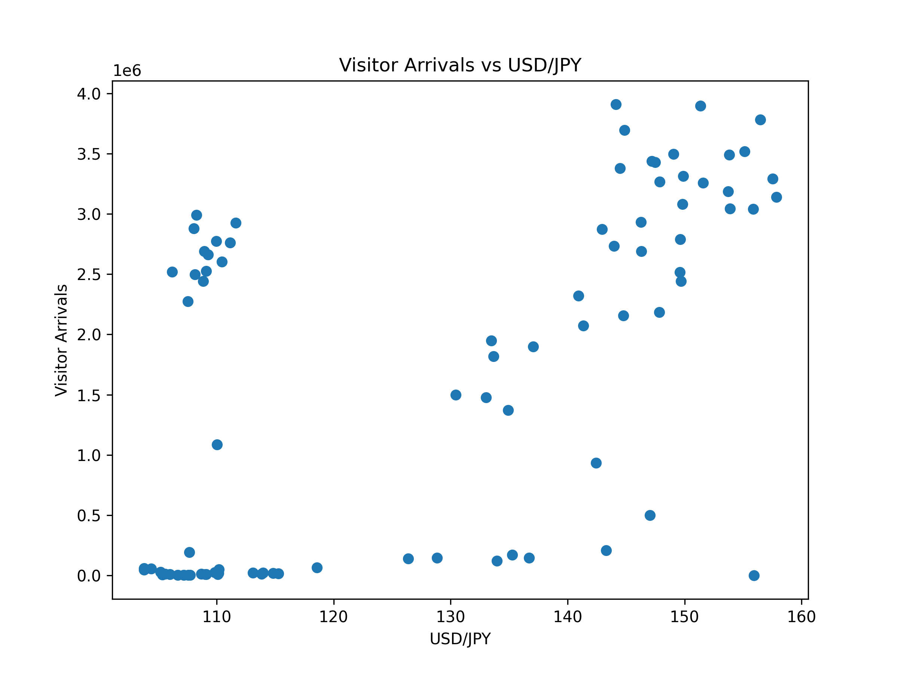

# Tourism Demand Forecast for Japan  
Forecasting inbound tourism demand using macroeconomic indicators and search trends

## Overview

This project analyzes and forecasts monthly inbound tourism demand to Japan using a time-series model.

Tourism demand is influenced by various factors such as exchange rates and travel interest.  
In this project, I combine macroeconomic indicators and online search trends to build a forecasting model.

The analysis focuses on three key signals:

- Visitor arrivals to Japan
- Exchange rate indicators
- Google search trends related to travel to Japan

The goal is to explore whether these signals can help explain and predict inbound tourism demand.

---

## Data Sources

The analysis uses publicly available datasets:

- **Visitor arrivals**  
  Japan National Tourism Organization (JNTO)

- **Exchange rate**
  - USD/JPY (FRED)
  - Real Effective Exchange Rate (BIS)

- **Search trends**  
  Google Trends (travel-related keywords)

The datasets were converted to monthly frequency and aligned for time-series analysis.

---

## Methodology

The forecasting model uses **SARIMAX (Seasonal ARIMA with exogenous variables)**.

SARIMAX was chosen because:

- Tourism demand has **strong seasonality**
- Exchange rates and search trends can be included as **exogenous variables**
- It is widely used in **economic time-series forecasting**

Model inputs include:

- Lagged visitor arrivals
- Exchange rate indicators
- Google search trends

---

## Exploratory Analysis

### Visitor Arrivals

Inbound tourism to Japan shows strong growth before COVID-19 and a sharp decline during the pandemic.

---

### Exchange Rate Indicators

Exchange rate movements can affect travel affordability and may influence inbound demand.

---

### Google Trends

Search activity related to travel to Japan can reflect travel interest before actual visits occur.

---

## Forecast Results

The SARIMAX model captures the seasonal pattern of inbound tourism and produces reasonable forecasts when macro indicators are included.

This suggests that combining economic indicators and search trends may help improve tourism demand forecasting.

---

## Repository Structure
data/ # raw and processed datasets
notebooks/ # analysis and modeling notebooks
outputs/ # figures used in the README
src/ # data processing and modeling scripts

---

## How to Run

Install dependencies:
pip install -r requirements.txt

Run the analysis notebook:
notebooks/tourism_demand_forecast.ipynb

---

## Author

Ryo Kawada
