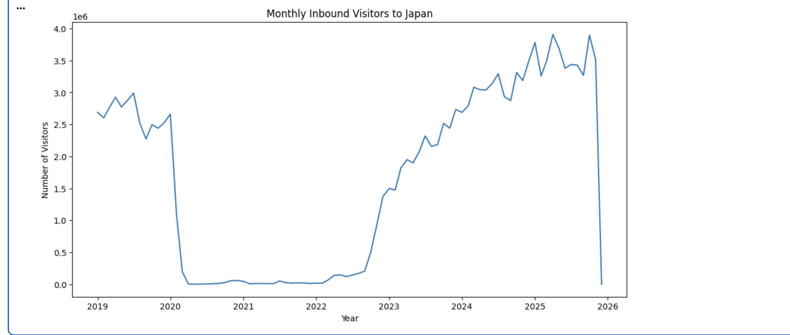
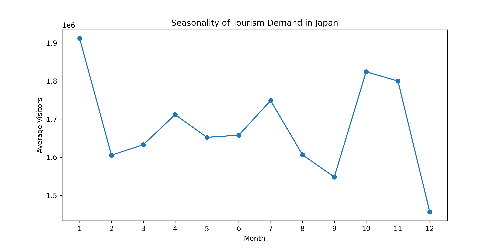
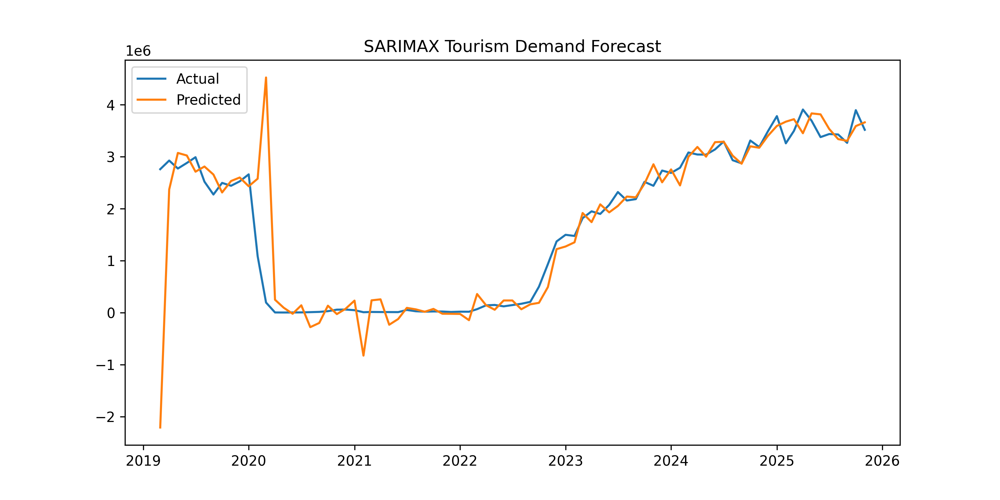
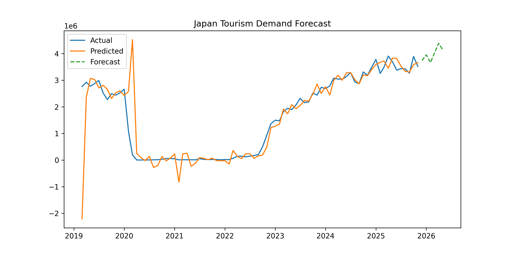

# Tourism Demand Forecast Japan
## Analyzed by: Passed the CPA Exam (Japan) | Tourism Data Analyst

## Overview

## Data Sources
- JNTO (Foreign Visitors to Japan, Tourism Consumption)
- Gooole trends
- Bank for International Settlements (BIS)

## Methods
## Key Findings

## Visualization
### Monthly inbound tourism trend

The figure shows monthly inbound visitors to Japan from 2019 onward.
The data clearly captures the sharp collapse in tourism during the COVID-19 pandemic and the strong recovery that began in 2023.

### Seasonality of tourism demand

Tourism demand in Japan shows clear seasonal patterns.
Visitor numbers tend to increase during spring (cherry blossom season),
summer holidays, and autumn foliage season.

### SARIMAX Tourism Demand Forecast

Tourism demand forecast

The SARIMAX model closely tracks the historical tourism demand.
The dashed green line shows the forecast for the upcoming months.
The model suggests that inbound tourism demand will remain strong in the near term,
assuming current macroeconomic conditions and search demand trends continue.

## Conclusion
This project forecasts inbound tourism demand to Japan using a SARIMAX model.

Explanatory variables include:
- Real Effective Exchange Rate (BIS)
- Google Trends search demand
- Lagged search indicators

The model captures both macroeconomic effects and travel demand signals.
